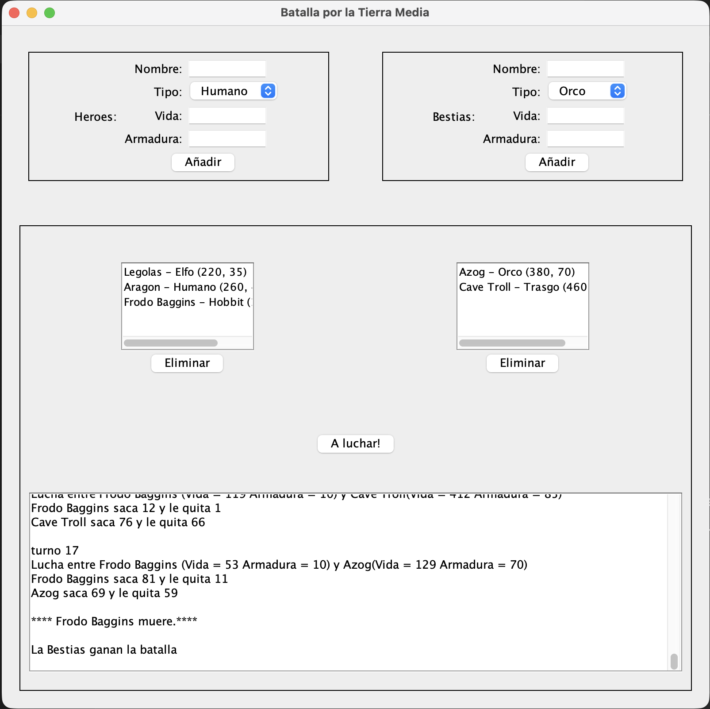

# Bienvenido a mi perfil de GitHub! 👋

### Aquí encontrarás mis proyectos tanto académicos como personales, donde aplico lo aprendido para reforzar mis conocimientos y seguir creciendo en este gran mundo del desarrollo que estoy construyendo

### 🕹️ Proyectos Destacados

#### **[Sales Analysis Dashboard - English School](https://github.com/Diejandro/analisis-ventas-javafx)**

* **Descripción:** Aplicación de escritorio para la gestión comercial y análisis de ventas. Este es mi proyecto más completo hasta la fecha, enfocado en transformar datos planos en información visual para una academia de idiomas.
* **Tecnologías:** `Java 21`, `JavaFX (FXML)`, `Maven`, `CSS`.
* **Lo que aprendí:** Integración de gráficos dinámicos, generación de informes en HTML y diseño de experiencia de usuario (UX/UI). Un valor añadido es que toda la **iconografía fue diseñada manualmente** para este proyecto.

---

#### **[Batalla por la Tierra Media (Versión GUI)](https://github.com/Diejandro/juego-batalla-gui-java)**

* **Descripción:** Evolución del proyecto original hacia un entorno gráfico interactivo.
* **Tecnologías:** `Java 17`, `Swing`, `AWT`, `POO` (Herencia, Interfaces, Polimorfismo).
* **Lo que aprendí:** Sustitución de la lógica secuencial por una arquitectura basada en eventos (Event-Driven), diseño de interfaces con `GridBagLayout` y gestión de estados de la interfaz mediante componentes visuales.

---

#### **[Mini Juego de Consola (Versión Original)](https://github.com/Diejandro/mi-juego-consola)**
* **Descripción:** Motor de simulación de combate automatizado que procesa enfrentamientos épicos entre ejércitos preconfigurados de Héroes y Bestias.
* **Tecnologías:** `Java`, `Lógica de Algoritmos`, `Colecciones` (ArrayList, Queue, Iterators).
* **Hito:** Mi primer gran proyecto tras finalizar el curso en **Tokio School**, enfocado en la arquitectura de clases y la resolución de lógica compleja.

# Mis estadísticas de GitHub

### Contact:

